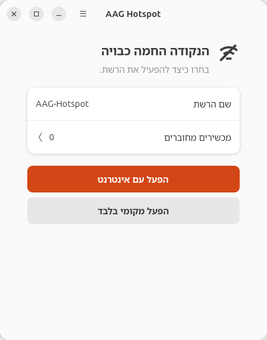
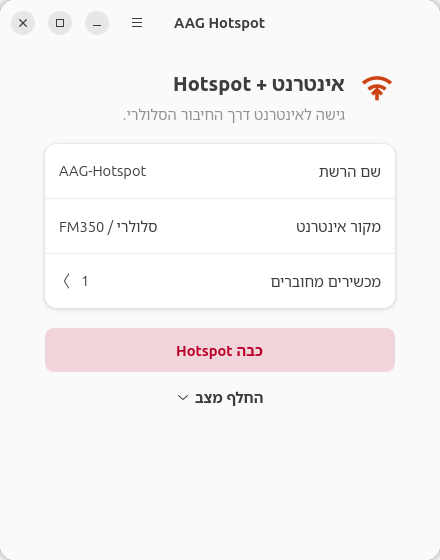
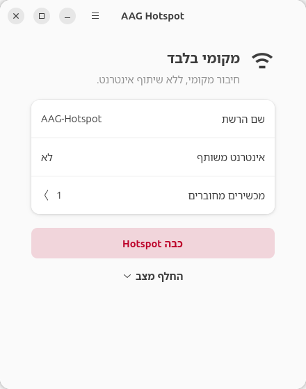
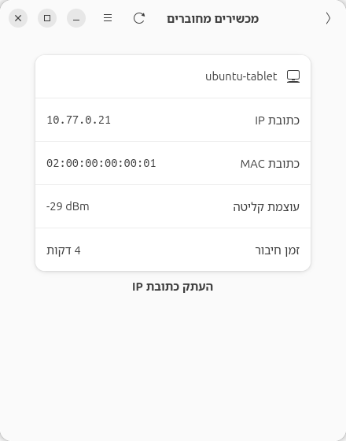
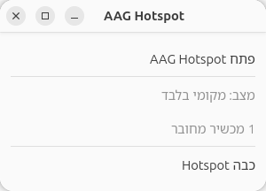

# AAG Hotspot Control

A native Ubuntu/GNOME application for turning a Linux laptop into a Wi-Fi hotspot.
Share an existing cellular Internet connection, create a **local-only LAN without
sharing Internet**, or turn the hotspot off. See connected devices without
switching to a terminal.

**Current public preview: v0.2.1.** The GUI is currently **Hebrew RTL only**; there is
no English GUI yet. This is a conservative, hardware-dependent tool, not a universal
replacement for every Linux network manager. Read the requirements before installing.

## Features

- Native GTK4/Libadwaita GUI with stable window size, light/dark themes and a separate devices page.
- **Hotspot + Internet:** share the existing supported cellular connection through `wwan0`.
- **Local-only Hotspot:** a private LAN with external IPv4 forwarding, IPv6 bypass and recursive DNS blocked.
- **Off:** deactivate and remove the current AAG-owned hotspot resources.
- Connected-client name, IPv4, MAC, signal strength, connection duration and copy-IP action.
- Minimal symbolic tray indicator with mode/count tooltip and a quick OFF action.
- NetworkManager shared-mode DHCP/DNS and NAT, with an explicitly scoped nftables guard.
- Unprivileged GUI, fixed Polkit helper, bounded device readiness and ownership-checked rollback.
- Independent CLI, diagnostics, idempotent installation and scoped removal.

## Screenshots

These are clean application-only captures with **synthetic demonstration data**.
They do not imply new physical-client acceptance or show a real device's identity.

| OFF | Internet sharing |
| --- | --- |
|  |  |

| Local-only LAN | Connected devices |
| --- | --- |
|  |  |



The tray image is a native GTK preview of the exported menu model. Actual panel
appearance and click behavior are controlled by the desktop's indicator host.

## Requirements

The host-side architecture was exercised on **Ubuntu 26.04 x86_64**, GNOME,
NetworkManager **1.54**, Intel Wi-Fi with AP/virtual-interface support, and an
FM350 cellular modem using `wwan0mbim0` / `wwan0`. Other distributions, architectures
and radio/modem combinations have not been validated.

The installer checks, without changing networking:

- Ubuntu 26.04 x86_64 and the required programs/libraries.
- NetworkManager 1.54 already running, with `firewall-backend=iptables`.
- Global IPv4 forwarding already enabled (`net.ipv4.ip_forward=1`).
- An existing managed Wi-Fi interface, advertised AP support and legal 2.4 GHz channel 6.
- GTK4 and Libadwaita 1.8 or newer.

The backend additionally refuses an active/connecting Wi-Fi station, an overlapping
`10.77.0.0/24` route, occupied AAG resource names or a different Internet route.
**Same-radio Wi-Fi STA + AP uplink is UNVALIDATED and DISABLED.** The program never
disconnects an existing Wi-Fi connection to make space.

These requirements are deliberate gates. The installer **does not** switch a global
firewall backend, enable forwarding, restart NetworkManager or reconfigure a modem
to make an incompatible machine pass. See [compatibility](docs/COMPATIBILITY.md).

## Installation

Download these files from the [v0.2.1 release](https://github.com/aagprojectsteam-max/aag-hotspot-control/releases/tag/v0.2.1):

- `aag-hotspot-control-v0.2.1.tar.gz`
- `SHA256SUMS`
- `release-manifest.json`

Place them in the same directory, then:

```sh
sha256sum --check SHA256SUMS
tar -xzf aag-hotspot-control-v0.2.1.tar.gz
cd aag-hotspot-control-v0.2.1
sudo ./install.sh
```

Installation creates **no hotspot and no autostart**. It installs the GUI, CLI,
launcher, symbolic tray icons, scoped helper and recovery service definition.
It records nonsecret hardware/profile bindings locally in a protected installation
file; no developer connection UUIDs are distributed. Keep the extracted directory
for removal and inspection.

If dependencies are missing, install the distribution packages first:

```sh
sudo apt update
sudo apt install python3 python3-gi python3-gi-cairo gir1.2-gtk-4.0 \
  gir1.2-adw-1 network-manager iw iproute2 nftables iptables dnsmasq-base \
  polkitd pkexec desktop-file-utils
```

For GNOME's optional tray host:

```sh
sudo apt install gnome-shell-extension-appindicator
```

Enable that extension through GNOME Extensions if necessary; the application
installer does not change desktop extensions or login autostart. The main window
works without a tray host.

Run `sudo ./install.sh --check` for read-only compatibility checks. Administrator access is needed to inspect protected NetworkManager configuration. If several radios
exist, use `sudo ./install.sh --wifi-interface wlan0` with the intended existing
interface name. No interface is renamed or created during installation.

For development, cloning is optional:

```sh
git clone https://github.com/aagprojectsteam-max/aag-hotspot-control.git
cd aag-hotspot-control
sudo ./install.sh --check
sudo ./install.sh
```

## Usage

Open **AAG Hotspot** from GNOME Apps. The window runs as your normal user.
Opening or refreshing it only reads status.

| GUI control | Meaning |
| --- | --- |
| הפעל עם אינטרנט | Start Hotspot + Internet using the bound cellular connection |
| הפעל מקומי בלבד | Start a local-only hotspot |
| כבה Hotspot | Turn the active hotspot off |
| החלף מצב | Switch between Internet and local-only modes |
| מכשירים מחוברים | Open the connected-device page |
| סיסמת הרשת… | Configure the password securely, while OFF |

SSID: **AAG-Hotspot**. Host address: **10.77.0.1/24**. Band/channel: **2.4 GHz / 6**.
Use the password menu before first activation, or `aag-hotspot configure` for a
secure terminal prompt. Passwords must be 12–63 printable ASCII characters.
They are stored root-owned with mode 0600 and are never returned by status/doctor,
tray or diagnostics. There is no stored-password reveal API.

Administrator authentication is requested for explicit privileged operations.
Do not run the GUI as root. Closing the GUI does not turn off a running hotspot;
use the OFF button or CLI command.

### CLI

```sh
aag-hotspot internet             # start cellular Internet sharing
aag-hotspot local                # start a local-only LAN
aag-hotspot off                  # stop and clean the owned session
aag-hotspot status               # current state and connected clients
aag-hotspot status --json        # machine-readable status
aag-hotspot doctor               # read-only dependency/status checks
aag-hotspot configure            # secure password prompt; no activation
```

Additional flags and examples: [CLI reference](docs/CLI.md).

## Local-only mode

Associated clients stay on the hotspot LAN. The AAG guard drops external forwarding
for IPv4 and IPv6, disables IPv6 on the AP, and blocks recursive DNS in local-only
mode. No upstream Internet connection is required.

Clients can use local services, LAN chat, file transfer and SSH **between clients**
when their own firewalls/services permit them. Host access is intentionally narrower:
the current policy permits selected discovery/chat traffic and ICMP, but **does not
expose the laptop's SSH port, arbitrary host services or Docker-published ports**.
Do not assume local-only mode opens every host service. BeeBEEP and real external
client communication still require acceptance testing. [Security model](docs/SECURITY-MODEL.md).

## Connected devices

Only stations associated with the active AAG AP are shown. MAC addresses come from
`iw station dump`; current DHCP leases provide IPv4/hostname; a reachable neighbor
is an address fallback only. Signal and connected time come from the station data.
Unknown names display **לא ידוע**; absent addresses remain unknown.

The GUI updates every five seconds in a background worker. Client snapshots expire
after 15 seconds without a fresh update. A reconnect or mode switch can produce a
new IP: the next snapshot replaces the old address. Copy IP uses the current
snapshot and never starts SSH. A DHCP lease without an associated station is not
counted as connected.

## Tray

The indicator uses a small symbolic icon, no top-bar text, and a mode/count tooltip.
Its minimal menu offers Open, state/count and OFF while active. On the tested Ubuntu
AppIndicator host, **single-click opens the menu; double-click opens the app**.
Other hosts can map the standard Activate action directly to a primary click.
Closing the main window keeps the tray available when a host is registered.

## Updating

Download and verify the next release, turn the hotspot off, extract it and run
`sudo ./install.sh` from that version. Identical files are skipped; modified/unowned
installed files cause refusal instead of overwrite. Existing local bindings and
credentials are preserved. To intentionally bind a changed radio/cellular profile,
with the intended cellular connection already active and hotspot OFF, run
`sudo ./install.sh --rebind`. This reads state; it does not establish connections.

The public package uses a fresh public receipt layout. It is **not** an automatic
migration path for unpublished development installations with forensic documents
in their receipt. Such installations require a separate reviewed migration.

## Troubleshooting

| Symptom | Check |
| --- | --- |
| Wi-Fi unavailable or rfkill blocked | Check airplane mode and the physical switch; inspect `rfkill list`. The app will not bypass a block. |
| AP unsupported / channel unavailable | Inspect `iw list`; the driver must support AP and permit channel 6 in your regulatory domain. |
| NetworkManager not ready | Run `aag-hotspot doctor`. Activation waits for the exact owned device with a bounded timeout and cleanup on failure. |
| No Internet uplink | The bound GSM connection must already be active on `wwan0mbim0`, with all IPv4 default routes through `wwan0`. |
| New client IP | Reconnect/mode switches may assign another address; use the refreshed devices page. |
| Client missing | Ensure it is associated with the AAG SSID; a saved lease alone is not association. Wait for a fresh snapshot. |
| Docker/Tailscale coexistence | Existing ownership is preserved. VPN routes, subnet overlap or another forwarding drop policy can cause refusal or block client Internet; do not flush global rules. |
| Tray missing | Install/enable a compatible AppIndicator host. Use the main window if unavailable. |
| Installer rejects environment | Read the exact prerequisite failure and [compatibility](docs/COMPATIBILITY.md); no global network configuration is changed automatically. |

See [detailed troubleshooting](docs/TROUBLESHOOTING.md). Never post raw credentials,
NetworkManager secret files, full firewall dumps or personal network identifiers.

## Uninstall

From the extracted public release directory:

```sh
sudo ./uninstall.sh
```

Removal first uses the installed ownership-checked AAG OFF path, then removes only
receipt-owned files after cleanup is confirmed. Failed cleanup leaves the installation
available for recovery. Saved Wi-Fi profiles, the generic **Hotspot** profile,
cellular profiles, Docker and Tailscale are preserved. Credentials are retained by
default; `sudo ./uninstall.sh --purge-credentials` explicitly removes only AAG's
stored password. `sudo ./uninstall.sh --dry-run` is inspection-only and does not stop
an active hotspot; it requires OFF for full removal validation.

## Architecture

```text
Hebrew GTK/Libadwaita GUI + symbolic tray / independent CLI
                         ↓
                 unprivileged client transport
                         ↓
                  fixed Polkit helper
                         ↓
             bounded controller + ownership journal
                         ↓
       NetworkManager AP/DHCP/DNS/NAT + AAG nftables guard
```

The application owns only generated AAG profiles/interfaces and the `inet aag_hotspot`
guard. The on-demand supervisor and idempotent OFF path clean incomplete operations.
[Architecture details](docs/ARCHITECTURE.md).

## Security

The GUI is unprivileged. The helper accepts a fixed command set and no shell commands,
interface expressions or user firewall scripts. Secrets use protected files and stdin,
not command-line arguments. There is no broad sudoers rule, global firewall flush,
NetworkManager restart or automatic startup. Read [SECURITY.md](SECURITY.md) for
reporting vulnerabilities privately and [the threat model](docs/SECURITY-MODEL.md).

## Known limitations

- Only the Ubuntu/NetworkManager/cellular path described above has host-side evidence.
- The new public install-time binding is covered by local mock and staging tests;
  it has not been live-activated on a separate clean machine.
- Full physical-client Internet, client-to-host/host-to-client and BeeBEEP acceptance
  remain **NOT_TESTED**. Screenshots use fixtures.
- Same-radio Wi-Fi STA + AP uplink remains **UNVALIDATED_DISABLED**.
- No English GUI, stored-password reveal, arbitrary uplink selection, subnet/channel
  editor or general host-service exposure is provided.
- This first public release is a **preview**, not a universal hardware compatibility promise.

## Contributing

Read [CONTRIBUTING.md](CONTRIBUTING.md). CI runs hardware-free unit/regression tests,
syntax, packaging and privacy/secret checks. Live Wi-Fi tests belong on a spare machine
with a reviewed rollback plan, never automatically in CI.

## License

Original project code and symbolic assets are under the [MIT License](LICENSE).
System dependencies retain their own licenses and are not bundled. See
[THIRD_PARTY.md](THIRD_PARTY.md) and [CHANGELOG.md](CHANGELOG.md).
