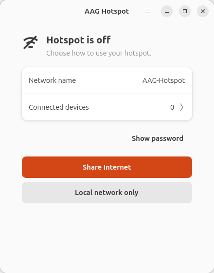
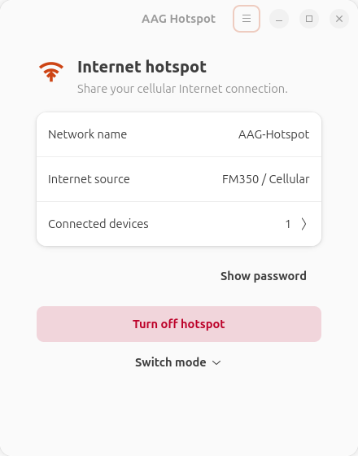
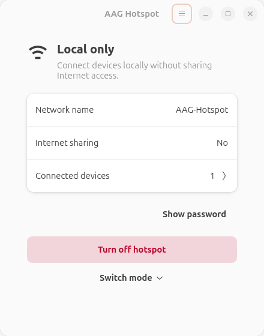
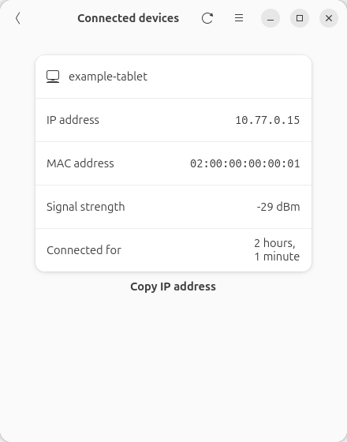
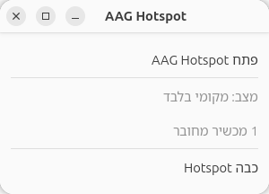
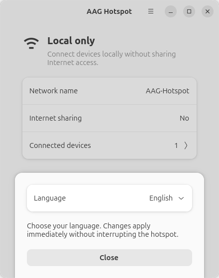
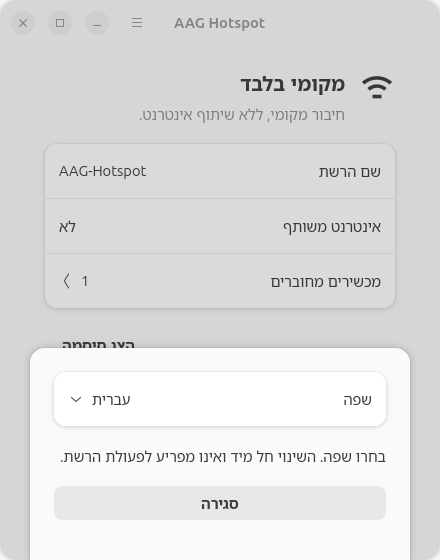

# AAG Hotspot Control

A native Ubuntu/GNOME application for turning a Linux laptop into a Wi-Fi hotspot.
Share the current supported Cellular or Ethernet Internet connection, create a **local-only LAN without
sharing Internet**, or turn the hotspot off. See connected devices without
switching to a terminal.

**v0.3.0 Preview candidate — installed live acceptance pending.**

English is the default for fresh user profiles; Hebrew
remains fully supported with RTL layout. Select **Settings → Language** to switch
immediately. The currently published v0.2.2 preview predates this localization update.

This is a conservative, hardware-dependent tool, not a universal
replacement for every Linux network manager. Read the requirements before installing.

## Features

- Native GTK4/Libadwaita GUI with English and Hebrew, stable window size, light/dark themes and a separate devices page.
- **Hotspot + Internet:** automatically select the current supported Cellular or Ethernet route.
- **Local-only Hotspot:** a private LAN with external IPv4 forwarding, IPv6 bypass and recursive DNS blocked.
- **Off:** deactivate and remove the current AAG-owned hotspot resources.
- Authenticated password reveal/copy in every mode, with automatic hiding and clipboard expiry.
- Connected-client name, IPv4, MAC, signal strength, connection duration and copy-IP action.
- Minimal symbolic tray indicator with mode/count tooltip and a quick OFF action.
- NetworkManager shared-mode DHCP/DNS and NAT, with an explicitly scoped nftables guard.
- Unprivileged GUI, fixed Polkit helper, bounded device readiness and ownership-checked rollback.
- Independent CLI, diagnostics, idempotent installation and scoped removal.

## Screenshots

These show the v0.3.0 development UI in English, using clean application-only
captures with **synthetic demonstration data**.
They do not imply new physical-client acceptance or show a real device's identity.

| OFF | Internet sharing |
| --- | --- |
|  |  |

| Local-only LAN | Connected devices |
| --- | --- |
|  |  |



The tray image is a native GTK preview of the exported menu model. Actual panel
appearance and click behavior are controlled by the desktop's indicator host.

## Languages

- **English — default** for new user profiles, regardless of desktop language.
- **Hebrew — full RTL support**, with LTR IP/MAC addresses and other technical values.

Open **Settings → Language** and choose **English** or **עברית**. Changes apply
immediately to the window, device page, dialogs, errors and tray. They never
restart the hotspot or networking services. Preferences are private to your user.

An existing user's trusted window-settings file from the Hebrew-only GUI triggers
a one-time migration to Hebrew. A saved language selection always takes priority.
Users without that legacy evidence start in English. See [localization and
migration](docs/LOCALIZATION.md) for details and translator instructions.

| English settings | Hebrew settings |
| --- | --- |
|  |  |

## Requirements

The host-side architecture was exercised on **Ubuntu 26.04 x86_64**, GNOME,
NetworkManager **1.54**, Intel Wi-Fi with AP/virtual-interface support, and an
FM350 cellular modem using `wwan0mbim0` / `wwan0`. Other distributions, architectures
and radio/modem combinations have not been validated.

The installer checks, without changing networking:

- Ubuntu 26.04 x86_64 and the required programs/libraries.
- NetworkManager 1.54 already running, with `firewall-backend=iptables`.
- Global IPv4 forwarding already enabled (`net.ipv4.ip_forward=1`).
- An existing managed Wi-Fi interface, advertised AP support and legal 2.4 GHz channel 6.
- GTK4 and Libadwaita 1.8 or newer.

The backend additionally refuses an active/connecting Wi-Fi station, an overlapping
`10.77.0.0/24` route, occupied AAG resource names or an unsupported Internet route.
**Same-radio Wi-Fi STA + AP uplink is UNVALIDATED and DISABLED.** The program never
disconnects an existing Wi-Fi connection to make space.

These requirements are deliberate gates. The installer **does not** switch a global
firewall backend, enable forwarding, restart NetworkManager or reconfigure a modem
to make an incompatible machine pass. See [compatibility](docs/COMPATIBILITY.md).

## Installation

Download these files from the [v0.2.2 release](https://github.com/aagprojectsteam-max/aag-hotspot-control/releases/tag/v0.2.2):

- `aag-hotspot-control-v0.2.2.tar.gz`
- `SHA256SUMS`
- `release-manifest.json`

Place them in the same directory, then:

```sh
sha256sum --check SHA256SUMS
tar -xzf aag-hotspot-control-v0.2.2.tar.gz
cd aag-hotspot-control-v0.2.2
sudo ./install.sh
```

Installation creates **no hotspot and no autostart**. It installs the GUI, CLI,
launcher, symbolic tray icons, scoped helper and recovery service definition.
It records only the selected AP radio interface and wiphy in a protected local
file. No cellular UUID, provider, or fixed uplink interface is configured. Keep the extracted directory
for removal and inspection.

If dependencies are missing, install the distribution packages first:

```sh
sudo apt update
sudo apt install python3 python3-gi python3-gi-cairo gir1.2-gtk-4.0 \
  gir1.2-adw-1 network-manager iw iproute2 nftables iptables dnsmasq-base \
  polkitd pkexec desktop-file-utils
```

For GNOME's optional tray host:

```sh
sudo apt install gnome-shell-extension-appindicator
```

Enable that extension through GNOME Extensions if necessary; the application
installer does not change desktop extensions or login autostart. The main window
works without a tray host.

Run `sudo ./install.sh --check` for read-only compatibility checks. Administrator access is needed to inspect protected NetworkManager configuration. If several radios
exist, use `sudo ./install.sh --wifi-interface wlan0` with the intended existing
interface name. No interface is renamed or created during installation.

For development, cloning is optional:

```sh
git clone https://github.com/aagprojectsteam-max/aag-hotspot-control.git
cd aag-hotspot-control
sudo ./install.sh --check
sudo ./install.sh
```

## Usage

Open **AAG Hotspot** from GNOME Apps. The window runs as your normal user.
Opening or refreshing it only reads status.

| GUI control | Meaning |
| --- | --- |
| Share Internet / הפעל עם אינטרנט | Start Hotspot + Internet using the detected supported uplink |
| Local network only / הפעל מקומי בלבד | Start a local-only hotspot |
| Turn off hotspot / כבה Hotspot | Turn the active hotspot off |
| Switch mode / החלף מצב | Switch between Internet and local-only modes |
| Connected devices / מכשירים מחוברים | Open the connected-device page |
| Show password / הצג סיסמה | Authorize, reveal or copy the password in any mode |
| Change password… / סיסמת הרשת… | Configure the password securely, while OFF |

SSID: **AAG-Hotspot**. Host address: **10.77.0.1/24**. Band/channel: **2.4 GHz / 6**.
Use the password menu before first activation, or `aag-hotspot configure` for a
secure terminal prompt. Passwords must be 12–63 printable ASCII characters.
They are stored root-owned with mode 0600 and are never returned by status/doctor,
tray or diagnostics. An explicit authenticated GUI action can reveal/copy the stored
password without reconnecting the hotspot; see [password reveal](docs/PASSWORD_REVEAL.md).

Administrator authentication is requested for explicit privileged operations.
Do not run the GUI as root. Closing the GUI does not turn off a running hotspot;
use the OFF button or CLI command.

### CLI

```sh
aag-hotspot internet             # share the detected supported Internet uplink
aag-hotspot local                # start a local-only LAN
aag-hotspot off                  # stop and clean the owned session
aag-hotspot status               # current state and connected clients
aag-hotspot status --json        # machine-readable status
aag-hotspot doctor               # read-only dependency/status checks
aag-hotspot configure            # secure password prompt; no activation
```

Additional flags and examples: [CLI reference](docs/CLI.md).

## Automatic Internet uplink

The application asks the kernel which interface carries public IPv4 traffic, then
uses NetworkManager device and active-connection metadata to classify that path.
It handles modem control devices that differ from the routed IP interface. UUIDs
and connection names are status metadata, never eligibility identities.

- **Cellular:** dynamic WWAN/device/provider/profile discovery.
- **Ethernet:** dynamic physical Ethernet discovery, including private upstream routers.
- **Wi-Fi:** capability/channel architecture is implemented, but live STA+AP remains
  **UNVALIDATED_DISABLED**. Advertised interface combinations alone are insufficient.
- **Local-only:** no Internet, default route, connected uplink or provider is required.

Tailscale, ZeroTier, Docker, bridge, tunnel and AAG AP interfaces cannot be selected
automatically as Internet uplinks. An unsupported selected route is reported; the
app does not choose a different default behind your back. If the active sharing
path changes, supervision stops AAG safely. Start Internet mode again to use the
new supported path. No upstream connection is established or reconfigured by AAG.

Normal Cellular/Ethernet APs remain 2.4 GHz/channel 6. The gated same-radio Wi-Fi
planner follows the STA channel and preserves the existing STA; unsupported or
illegal channels are refused. Do not disconnect a working Wi-Fi connection just
to bypass these gates. See [architecture](docs/ARCHITECTURE.md) and
[validation limits](docs/VALIDATION.md).

## Local-only mode

Associated clients stay on the hotspot LAN. The AAG guard drops external forwarding
for IPv4 and IPv6, disables IPv6 on the AP, and blocks recursive DNS in local-only
mode. No upstream Internet connection is required.

Clients can use local services, LAN chat, file transfer and SSH **between clients**
when their own firewalls/services permit them. Host access is intentionally narrower:
the current policy permits selected discovery/chat traffic and ICMP, but **does not
expose the laptop's SSH port, arbitrary host services or Docker-published ports**.
Do not assume local-only mode opens every host service. BeeBEEP and real external
client communication still require acceptance testing. [Security model](docs/SECURITY-MODEL.md).

## Connected devices

Only stations associated with the active AAG AP are shown. MAC addresses come from
`iw station dump`; current DHCP leases provide IPv4/hostname; a reachable neighbor
is an address fallback only. Signal and connected time come from the station data.
Unknown names display **Unknown** (Hebrew: **לא ידוע**); absent addresses remain unknown.

The GUI updates every five seconds in a background worker. Client snapshots expire
after 15 seconds without a fresh update. A reconnect or mode switch can produce a
new IP: the next snapshot replaces the old address. Copy IP uses the current
snapshot and never starts SSH. A DHCP lease without an associated station is not
counted as connected.

## Tray

The indicator uses a small symbolic icon, no top-bar text, and a mode/count tooltip.
Its minimal menu offers Open, state/count and OFF while active. On the tested Ubuntu
AppIndicator host, **single-click opens the menu; double-click opens the app**.
Other hosts can map the standard Activate action directly to a primary click.
Closing the main window keeps the tray available when a host is registered.

## Updating

Download and verify the next release, turn the hotspot off, extract it and run
`sudo ./install.sh` from that version. Identical files are skipped; modified/unowned
installed files cause refusal instead of overwrite. Existing local bindings and
credentials are preserved. Old cellular bindings are automatically discarded on
upgrade. Recreating a cellular profile or changing providers never requires a
rebind. To intentionally select a changed AP radio, with hotspot OFF, run
`sudo ./install.sh --rebind`. This reads state; it does not establish connections.

The public package uses a fresh public receipt layout. It is **not** an automatic
migration path for unpublished development installations with forensic documents
in their receipt. Such installations require a separate reviewed migration.

## Troubleshooting

| Symptom | Check |
| --- | --- |
| Wi-Fi unavailable or rfkill blocked | Check airplane mode and the physical switch; inspect `rfkill list`. The app will not bypass a block. |
| AP unsupported / channel unavailable | Inspect `iw list`; the driver must support AP and permit channel 6 in your regulatory domain. |
| NetworkManager not ready | Run `aag-hotspot doctor`. Activation waits for the exact owned device with a bounded timeout and cleanup on failure. |
| No Internet uplink | Use doctor to inspect the kernel-selected public route and NM classification. Cellular/Ethernet must already be connected; virtual/VPN routes are rejected without fallback. |
| New client IP | Reconnect/mode switches may assign another address; use the refreshed devices page. |
| Client missing | Ensure it is associated with the AAG SSID; a saved lease alone is not association. Wait for a fresh snapshot. |
| Docker/Tailscale coexistence | Existing ownership is preserved. VPN routes, subnet overlap or another forwarding drop policy can cause refusal or block client Internet; do not flush global rules. |
| Tray missing | Install/enable a compatible AppIndicator host. Use the main window if unavailable. |
| Installer rejects environment | Read the exact prerequisite failure and [compatibility](docs/COMPATIBILITY.md); no global network configuration is changed automatically. |

See [detailed troubleshooting](docs/TROUBLESHOOTING.md). Never post raw credentials,
NetworkManager secret files, full firewall dumps or personal network identifiers.

## Uninstall

From the extracted public release directory:

```sh
sudo ./uninstall.sh
```

Removal first uses the installed ownership-checked AAG OFF path, then removes only
receipt-owned files after cleanup is confirmed. Failed cleanup leaves the installation
available for recovery. Saved Wi-Fi profiles, the generic **Hotspot** profile,
cellular profiles, Docker and Tailscale are preserved. Credentials are retained by
default; `sudo ./uninstall.sh --purge-credentials` explicitly removes only AAG's
stored password. `sudo ./uninstall.sh --dry-run` is inspection-only and does not stop
an active hotspot; it requires OFF for full removal validation.

## Architecture

```text
English/Hebrew GTK/Libadwaita GUI + symbolic tray / independent CLI
                         ↓
                 unprivileged client transport
                         ↓
                  fixed Polkit helper
                         ↓
             bounded controller + ownership journal
                         ↓
       NetworkManager AP/DHCP/DNS/NAT + AAG nftables guard
```

The application owns only generated AAG profiles/interfaces and the `inet aag_hotspot`
guard. The on-demand supervisor and idempotent OFF path clean incomplete operations.
[Architecture details](docs/ARCHITECTURE.md).

## Security

The GUI is unprivileged. The helper accepts a fixed command set and no shell commands,
interface expressions or user firewall scripts. Secrets use protected files and stdin,
not command-line arguments. There is no broad sudoers rule, global firewall flush,
NetworkManager restart or automatic startup. Read [SECURITY.md](SECURITY.md) for
reporting vulnerabilities privately and [the threat model](docs/SECURITY-MODEL.md).

## Known limitations

- v0.3.0 installed host-side acceptance is pending. Ethernet is covered by mocked tests; no live Ethernet evidence is claimed.
- The new public install-time binding is covered by local mock and staging tests;
  it has not been live-activated on a separate clean machine.
- Full physical-client Internet, client-to-host/host-to-client and BeeBEEP acceptance
  remain **NOT_TESTED**. Screenshots use fixtures.
- Same-radio Wi-Fi STA + AP uplink remains **UNVALIDATED_DISABLED**.
- Arbitrary uplink selection, subnet/channel editing and general host-service exposure
  are outside the current validated architecture.
- This first public release is a **preview**, not a universal hardware compatibility promise.

## Contributing

Read [CONTRIBUTING.md](CONTRIBUTING.md). CI runs hardware-free unit/regression tests,
syntax, packaging and privacy/secret checks. Live Wi-Fi tests belong on a spare machine
with a reviewed rollback plan, never automatically in CI.

## License

Original project code and symbolic assets are under the [MIT License](LICENSE).
System dependencies retain their own licenses and are not bundled. See
[THIRD_PARTY.md](THIRD_PARTY.md) and [CHANGELOG.md](CHANGELOG.md).
