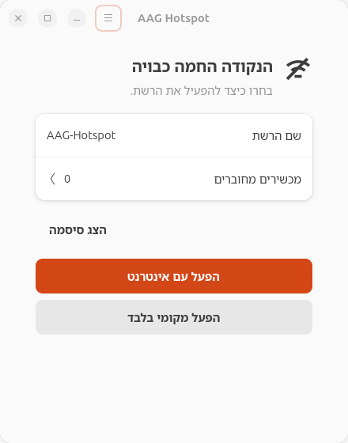

# Languages and translation

This is the internationalization component for **v0.3.0, unreleased**. The published
v0.2.2 preview predates it. Uplink architecture and hardware acceptance are separate
work; adding languages does not enable Wi-Fi STA + AP or change hotspot behavior.

## Choose a language

Open the window menu, then **Settings → Language**. Choose **English** or **עברית**.
English is the default for a fresh user profile, even on a Hebrew desktop. Hebrew
uses RTL layout. IP/MAC addresses, passwords, SSIDs and version numbers retain LTR
direction. Both languages use the same GUI implementation.

Selection applies immediately to the window, connected devices, dialogs, errors
and tray, without restarting the GUI, backend or hotspot. Changing language closes
any open password view and clears its secret buffer and owned clipboard. A later
explicit reveal still requires the existing scoped authorization. Translations
never contain a configured password.

The tray icon is independent of language. Its tooltip and menu follow the selected
language; the desktop's indicator host controls the final panel rendering. System
Polkit authentication and desktop shell dialogs use the desktop's language.



## Preference and upgrade migration

Preferences are stored as a mode-0600 file owned by the desktop user:

```text
$XDG_CONFIG_HOME/aag-hotspot/preferences.json
```

Without an XDG override, the directory is `~/.config/aag-hotspot`. The file contains
only a schema number and language code. It has no password, network configuration
or privileged settings. Explicit selection is retained across GUI restarts.

When no preference exists, a trusted, user-owned, private and valid `window.json`
from the previous Hebrew-only GUI is evidence that this user already used Hebrew.
That user is initialized to Hebrew once. Otherwise the default is English. Package
installation or the existence of system credentials alone does not trigger migration.
An explicit language preference always wins over the legacy window file.

Malformed or unsafe settings fall back to English with a localized notice; the
application does not overwrite the invalid file automatically. If saving a new
selection fails, the current language stays selected and the GUI explains the error.

For an existing compatible installation, the development tree includes a scoped
UI-only updater:

```sh
sudo /usr/bin/python3 -I scripts/install-ui.py
```

It verifies the installation receipt and updates only the fixed UI/catalog/icon
allowlist. Close and reopen the GUI once to load updated program files. Subsequent
language selections take effect immediately. The updater never activates a hotspot,
restarts networking, or replaces the backend. Fresh installation uses the normal
installer, which includes the compiled catalogs.

## Translator workflow

English source strings use Python gettext, domain `aag-hotspot`. Hebrew translations
are maintained in `po/he.po`; `po/aag-hotspot.pot` is the extraction template. The
compiled resource ships inside the Python package, so end users do not need gettext
development tools installed.

With GNU gettext tools installed, run from the source tree:

```sh
/usr/bin/python3 scripts/update-translations.py
msgmerge --update --backup=none po/he.po po/aag-hotspot.pot
# Edit po/he.po, resolve fuzzy entries, and preserve format placeholders.
/usr/bin/python3 scripts/update-translations.py
/usr/bin/python3 scripts/check-i18n.py
```

Commit the PO, POT and compiled MO together. The coverage check rejects missing
messages, mismatched format fields, stale compiled resources, hardcoded Hebrew in
runtime UI modules, and untranslated literal widget labels. Add languages centrally
in `i18n.py` (code, direction and native selector label), add their catalogs, extend
the UI updater's resource allowlist and add equivalent tests. No separate GUI is
needed. Machine-readable CLI keys and values remain unchanged.

## Validation and limits

- Fresh English defaults, one-time Hebrew migration, persistence, unsafe settings,
  translation coverage and unchanged CLI output have automated unit coverage.
- Real GTK/Libadwaita and session tray tests passed 215 checks across both languages,
  light/dark themes, OFF/Internet/local views, devices, errors, passwords, language
  switching, narrow layouts and LTR technical values.
- The installed GUI passed the same 215 checks and 33 existing password-dialog
  regression checks. The existing Hebrew user's migration was verified on the host.
- The UI-only update matched source, was idempotent, and preserved all 37 non-UI
  installed files and the protected network snapshot.

Active-mode UI tests use synthetic transport state and assert that a language
change issues **no network control calls**. No real hotspot was activated for this
work; the production hotspot stayed OFF. These checks do not establish physical
client connectivity or new uplink support.
